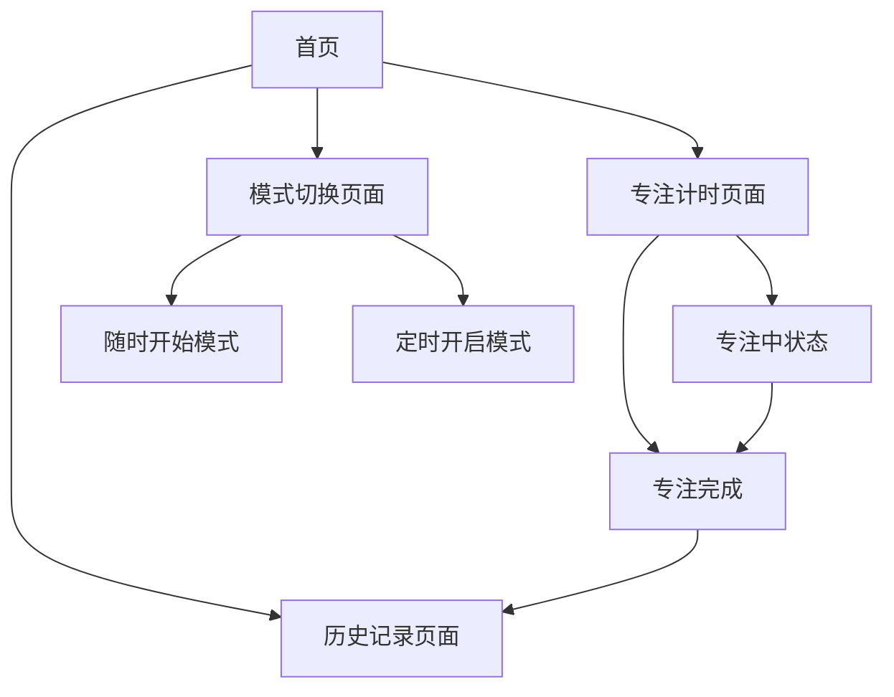

## 1. 产品概述

智能自我专注时长监测系统是一款帮助用户管理学习专注时间的工具。用户可以随时开始专注模式进行学习，也可以设置定时开启模式，灵活设定学习时长，提升学习效率。

目标用户：学生、职场人士等需要专注学习或工作的人群，帮助他们建立良好的时间管理习惯，提高专注力和学习效率。

## 2. 核心功能

### 2.1 用户角色

| 角色   | 注册方式      | 核心权限            |
| ---- | --------- | --------------- |
| 普通用户 | 邮箱注册/游客模式 | 使用专注计时功能、查看历史记录 |

### 2.2 功能模块

系统包含以下主要页面：

1. **专注计时页面**：实时显示专注状态、倒计时、进度条。
2. **模式切换页面**：随时开始模式和定时开启模式的切换界面。
3. **历史记录页面**：展示过往的专注记录和统计数据。

### 2.3 页面详情

| 页面名称   | 模块名称   | 功能描述                            |
| ------ | ------ | ------------------------------- |
| 专注计时页面 | 计时显示模块 | 显示当前专注时长、剩余时间、进度条动画             |
| 专注计时页面 | 控制按钮模块 | 开始、暂停、停止专注计时                    |
| 专注计时页面 | 模式显示模块 | 显示当前模式（随时开始/定时开启）               |
| 模式切换页面 | 模式选择模块 | 切换随时开始和定时开启两种模式                 |
| 模式切换页面 | 时长设定模块 | 设置专注时长（15分钟、30分钟、45分钟、60分钟、自定义） |
| 模式切换页面 | 定时设置模块 | 设置定时开始时间                        |
| 历史记录页面 | 记录列表模块 | 展示历史专注记录                        |
| 历史记录页面 | 统计图表模块 | 显示日/周/月专注时长统计                   |
| 历史记录页面 | 成就徽章模块 | 显示专注成就和里程碑                      |

## 3. 核心流程

### 随时开始模式流程

用户进入系统 → 选择随时开始模式 → 设置专注时长 → 点击开始专注 → 进入专注状态 → 专注结束查看结果

### 定时开启模式流程

用户进入系统 → 选择定时开启模式 → 设置专注时长和开始时间 → 等待定时开始 → 自动进入专注状态 → 专注结束查看结果

## 4. 用户界面设计

### 4.1 设计风格

* **主色调**：深蓝色 (#1e3a8a) 代表专注与冷静

* **辅助色**：浅蓝色 (#3b82f6) 和白色 (#ffffff)

* **按钮样式**：圆角矩形，悬停效果，主要操作为填充色，次要操作为边框

* **字体**：系统默认字体，标题18-24px，正文14-16px

* **布局风格**：卡片式布局，居中对齐，简洁明了

* **图标风格**：使用线性图标，简洁现代

### 4.2 页面设计概述

| 页面名称   | 模块名称   | UI元素                 |
| ------ | ------ | -------------------- |
| 专注计时页面 | 计时显示模块 | 大字体显示剩余时间，圆形进度条，动态更新 |
| 专注计时页面 | 控制按钮模块 | 底部排列开始/暂停/停止按钮，图标+文字 |
| 专注计时页面 | 模式显示模块 | 顶部标签显示当前模式，可点击切换     |
| 模式切换页面 | 模式选择模块 | 两个大卡片展示两种模式，图标+描述    |
| 模式切换页面 | 时长设定模块 | 预设时长按钮组，自定义输入框       |
| 模式切换页面 | 定时设置模块 | 时间选择器，日期选择器          |
| 历史记录页面 | 记录列表模块 | 时间轴形式展示历史记录          |
| 历史记录页面 | 统计图表模块 | 柱状图或折线图展示统计数据        |
| 历史记录页面 | 成就徽章模块 | 网格布局展示获得的成就徽章        |

### 4.3 响应式设计

* **桌面优先**：优先设计桌面端界面，确保功能完整

* **移动端适配**：支持平板和手机端，采用响应式布局

* **触摸优化**：按钮大小适配触摸操作，间距合理

