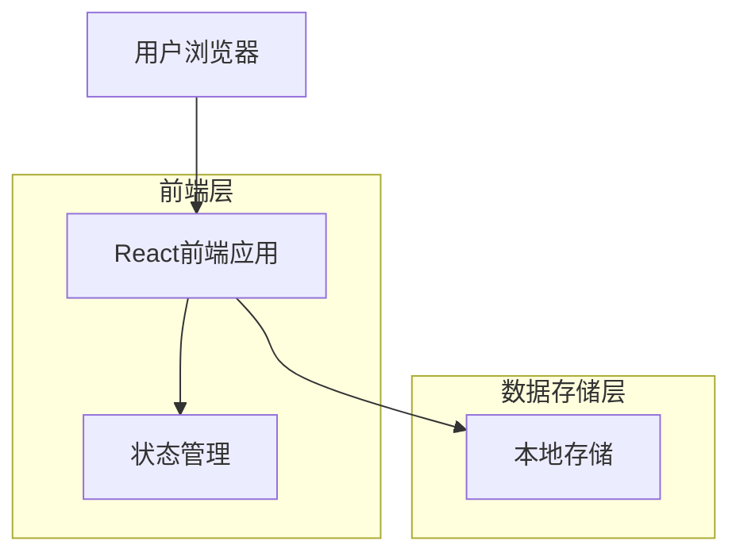
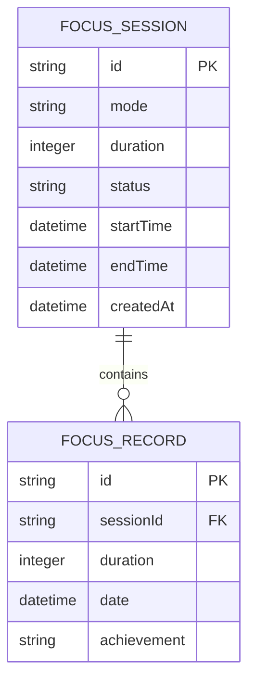

## 1. 架构设计



## 2. 技术描述

- **前端**: React@18 + TailwindCSS@3 + Vite
- **初始化工具**: vite-init
- **状态管理**: React Hooks (useState, useEffect, useContext)
- **本地存储**: localStorage + IndexedDB
- **后端**: 无（纯前端应用，数据存储在本地）

## 3. 路由定义

| 路由 | 用途 |
|------|------|
| / | 专注计时页面，主要的专注计时功能 |
| /mode | 模式切换页面，选择随时开始或定时开启模式 |
| /history | 历史记录页面，查看专注历史统计数据 |
| /settings | 设置页面，配置应用参数和偏好 |

## 4. 数据模型

### 4.1 数据模型定义



### 4.2 数据结构定义

专注会话 (FocusSession)
```typescript
interface FocusSession {
  id: string;
  mode: 'instant' | 'scheduled';  // 随时开始或定时开启
  duration: number;                   // 专注时长（分钟）
  status: 'pending' | 'running' | 'paused' | 'completed' | 'cancelled';
  startTime?: Date;
  endTime?: Date;
  scheduledTime?: Date;              // 定时开启时间
  createdAt: Date;
  updatedAt: Date;
}
```

专注记录 (FocusRecord)
```typescript
interface FocusRecord {
  id: string;
  sessionId: string;
  actualDuration: number;            // 实际专注时长（分钟）
  date: Date;
  achievement?: string;               // 获得的成就
  createdAt: Date;
}
```

用户设置 (UserSettings)
```typescript
interface UserSettings {
  defaultDuration: number;            // 默认专注时长
  soundEnabled: boolean;              // 是否开启声音提醒
  notificationEnabled: boolean;        // 是否开启通知
  theme: 'light' | 'dark';         // 主题模式
  dailyGoal: number;                 // 每日专注目标（分钟）
}
```

### 4.3 本地存储实现

专注会话存储
```javascript
// 使用 localStorage 存储当前会话
const saveCurrentSession = (session) => {
  localStorage.setItem('currentFocusSession', JSON.stringify(session));
};

// 使用 IndexedDB 存储历史记录
const saveFocusRecord = async (record) => {
  const db = await openDB('FocusMonitor', 1);
  await db.add('focusRecords', record);
};
```

## 5. 核心功能实现

### 5.1 计时器逻辑
```typescript
class FocusTimer {
  private duration: number;
  private remainingTime: number;
  private status: TimerStatus;
  private intervalId: NodeJS.Timeout | null;
  
  constructor(duration: number) {
    this.duration = duration * 60; // 转换为秒
    this.remainingTime = this.duration;
    this.status = 'stopped';
    this.intervalId = null;
  }
  
  start(): void {
    this.status = 'running';
    this.intervalId = setInterval(() => {
      this.remainingTime--;
      if (this.remainingTime <= 0) {
        this.complete();
      }
    }, 1000);
  }
  
  pause(): void {
    this.status = 'paused';
    if (this.intervalId) {
      clearInterval(this.intervalId);
      this.intervalId = null;
    }
  }
  
  complete(): void {
    this.status = 'completed';
    if (this.intervalId) {
      clearInterval(this.intervalId);
      this.intervalId = null;
    }
    // 触发完成事件
  }
}
```

### 5.2 定时任务调度
```typescript
class ScheduledTaskManager {
  private scheduledTasks: Map<string, NodeJS.Timeout> = new Map();
  
  scheduleTask(taskId: string, executeTime: Date, callback: Function): void {
    const now = new Date().getTime();
    const taskTime = executeTime.getTime();
    const delay = taskTime - now;
    
    if (delay > 0) {
      const timeoutId = setTimeout(() => {
        callback();
        this.scheduledTasks.delete(taskId);
      }, delay);
      
      this.scheduledTasks.set(taskId, timeoutId);
    }
  }
  
  cancelTask(taskId: string): void {
    const timeoutId = this.scheduledTasks.get(taskId);
    if (timeoutId) {
      clearTimeout(timeoutId);
      this.scheduledTasks.delete(taskId);
    }
  }
}
```

## 6. 状态管理设计

### 6.1 全局状态结构
```typescript
interface AppState {
  currentSession: FocusSession | null;
  timer: {
    remainingTime: number;
    status: 'idle' | 'running' | 'paused';
  };
  settings: UserSettings;
  history: FocusRecord[];
}
```

### 6.2 Context API 实现
```typescript
const AppContext = createContext<{
  state: AppState;
  dispatch: React.Dispatch<Action>;
} | null>(null);

const appReducer = (state: AppState, action: Action): AppState => {
  switch (action.type) {
    case 'START_FOCUS':
      return {
        ...state,
        currentSession: action.payload.session,
        timer: { remainingTime: action.payload.duration, status: 'running' }
      };
    case 'UPDATE_TIMER':
      return {
        ...state,
        timer: { ...state.timer, remainingTime: action.payload }
      };
    case 'COMPLETE_FOCUS':
      return {
        ...state,
        currentSession: null,
        timer: { remainingTime: 0, status: 'idle' },
        history: [...state.history, action.payload.record]
      };
    default:
      return state;
  }
};
```